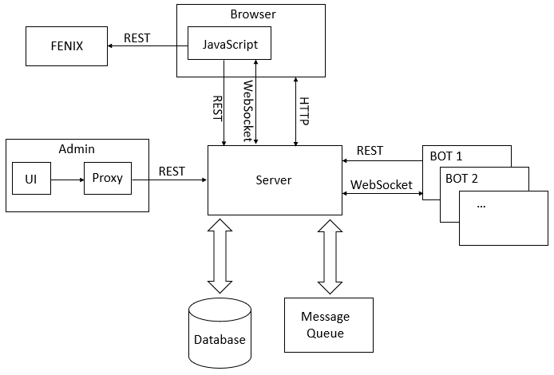

# Real-time message exchange system for IST students 

This project was developed for the Internet Systems Architecture course. It consists on a web application used to manage dissemination of messages to
users working in particular physical locations inside the IST facilities. In case of emergency, some notifications should be forwarded through digital means to users in specific locations/buildings. Besides that, users nearby can also exchange messages between them.

## Architecture

The overall architecture consists on three main components:

**Regular users (browser):** send their location to the server, send messages to nearby users, check who is nearby and receive messages (from other users or bots).

**Admin:** can access the logs of activities and manage static information.

**Bots:** programs assigned to a specific building and periodically send messages to users that are in that builing

On this repo, each component has a separated folder with an individual README.