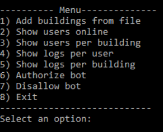

# Python based system administrator

This program interacts with the server through a REST API. It has the following funcionalities:

1) local login (username and password defined in params.json file).

2) reads building.json file (contains relevant info about some IST buildings), sending its content to the server.

3) lists all users online and per building.

4) list of logs (user activities history) per user and per building.

5) authorize and desauthorize bots.

The main menu looks like this:



## REST API

The following table shows the routes of the REST API developed for the communication between the server and the admin program:

|Method|               Path                  |                                 Arguments                                        |           Description         |
|:-----|:------------------------------------|:---------------------------------------------------------------------------------|:------------------------------|
| POST | /API/admin/buildings/add            |{id:[string], name:[string], latitude:[float], longitude:[float], radious:[float]}|    Add building in database   |
| GET  | /API/admin/buildings/show           |                                                                                  |  Retrieve all buildings in DB |
| GET  | /API/admin/users/show               |                                                                                  |    Retrieve all users in DB   |
| GET  | /API/admin/users/show/online        |                                                                                  |    Retrieve all users online  |
| GET  |/API/admin/users/show/building/<b_id>|                                                                                  |   Retrieve users in building  |
| GET  | /API/admin/logs/show/user/<u_id>    |                                                                                  |    Retrieve logs from user    |
| GET  | /API/admin/logs/show/building/<b_id>|                                                                                  |  Retrieve logs from building  |
| POST | /API/admin/bots/update/auth         |                        { id : [string] , state : [boolean] }                     | Update bot authorization state|
| GET  | /API/admin/bots/show/auth/<state>   |                                                                                  |         Retrieve all bots     |

## Instructions summary

1) Clone the repo
```
git clone https://github.com/dgarigali/RealtimeMessageExchange
```

2) Install all the required python libraries:
```
pip3 install requests 
sudo apt-get install python3-tk
```

3) Update params.json file with the hostname of your server

4) Run the application:
```
python3 admin.py
```