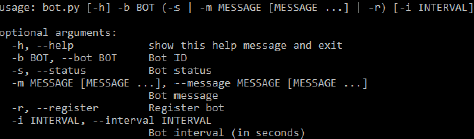

# Python based bot

This program, configurable via command line arguments, sends messages periodically to all users inside a given building. It also has a REST API for interfacing with the server. The funcionalities are:

1) help menu to know how to run the application.



2) check bot state. Can be unexistent (bot with given ID has not been registered yet), unauthorized (bot has not been authorized yet by the admin), busy (bot is already running in another machine) or available.

3) register a new bot. It requires to assign both a building and a password (automatically created by the server).

4) run bot, specifying the message to be sent and the time interval from which it will be sent every time (if omitted, only will send the message once)

The possible commands are:

|       Type       |                           Command                       |
|:-----------------|:--------------------------------------------------------|
| Help             |                        python3 bot.py -h                |
| Verification     |                python3 bot.py -b <BOT_NAME> -s          |
| Register         |                python3 bot.py -b <BOT_NAME> -r          |  
| Execution        | python3 bot.py -b <BOT_NAME> -m <BOT_MESSAGE> -i <BOT_INTERVAL> |

## REST API

The following table shows the routes of the REST API developed for the communication between the server and the admin program:

|Method|        Path              |                Arguments               |           Description         |
|:-----|:-------------------------|:---------------------------------------|:------------------------------|
| GET  | /API/bot/check/<boot_id> |                                        |       Check bot state         |
| GET  | /API/bot/show/buildings  |                                        |  Retrieve all buildings in DB |
| POST | /API/bot/register        | { id : [string] , b_id : [string] }    |      Register bot in DB       |
| POST | /API/bot/auth            | { id : [string] , pass : [string] }    |         Checks password       |
| POST | /API/bot/message         | { id : [string] , message : [string] } |     Send message to server    |

## Instructions summary

1) Clone the repo
```
git clone https://github.com/dgarigali/RealtimeMessageExchange
```

2) Install all the required python libraries:
```
pip3 install socketIO-client requests
```

3) Update url.json file with the hostname of your server

4) Run the application according to the commands available on the table above