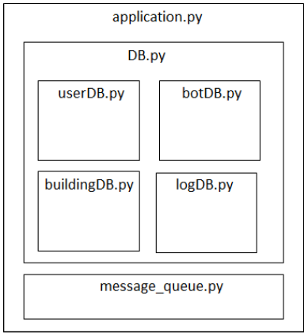
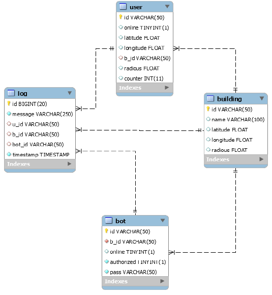
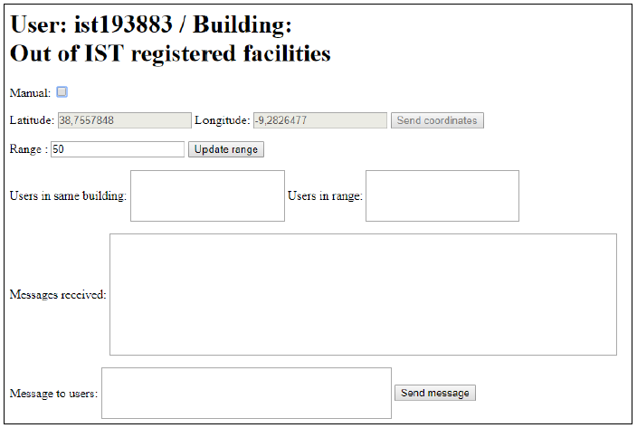

# Flask based server and javascript based client

This server uses websockets to ensure the real-time messages exchange and the verification of users and bots online as it allows a bidirectional communication between the server and the clients. The library that implements these websockets is [SocketIO](https://socket.io/).

## Requirements

You must have a Linux-based hosting server with Python3 and a MySQL server installed. Flask is a python based web application framework. To [deploy it on a hosting server](https://flask-socketio.readthedocs.io/en/latest/#deployment), you must run it using the gunicorn webserver with the eventlet worker (in order to allow the use of websockets). All the required steps are described on the instructions section.

## Server

Responsible for the reception, processing and reply of the requests from the clients, besides handling the communication with the database and message queue servers (both described below). The internal composition, in terms of python classes, is:



## Database schema

The MySQL database stores data related to each user, building, bot and log, according to the following schema:



Use the db.sql file to create the database and insert the user and password of the database in the credentials.json file.

## SocketIO API

This API is essentially used to know which users and bots are online and to notify users about new messages and new moviments from other users. 

These are the events to which the server is subscribed:

|    Event   |               Receives               |         Description         |
|:-----------|:-------------------------------------|:----------------------------|
| new_client | { ID : [string], token : [string] }  |      new user logged in     |
| new_bot    |            { ID : [string] }         |      new bot logged in      |
| disconnect |                                      |   user or bot logged out    |

These are the events where the server publishes:

|     Event    |                         Description                         |
|:-------------|:------------------------------------------------------------|
| new_movement |   notify browser to check the presence of new users nearby  |
| new_message  |   notify browser to check the presence of new messages      |

## Message queue (RabbitMQ)

For the message control mecanism, [RabbitMQ](https://www.rabbitmq.com/), a open-source message broker, was used. It takes care of all the logic about checking if the messages were read or not, besides allowing for the same Fenix user (described below) to received the messages on different tabs as RabbitMQ allows to create a queue for each sessions (and not only for each user).

For hosting the RabbitMQ server, there is [CloudAMQP](https://customer.cloudamqp.com). You must create an account, select the free version and create a new instance, which will give you an URL, which must be inserted in the credentials.json file.

## REST API

The following table shows the routes of the REST API developed for the communication between the server and the browser (javascript client):

|Method |               Path            |                                      Arguments                                       |         Description           |
|:------|:------------------------------|:-------------------------------------------------------------------------------------|:------------------------------|
| POST  | /API/user/update/coordinates  |        { id:[string] , latitude:[float] , longitude:[float] , token:[string] }       |     Update user location      |
| POST  | /API/user/update/range        |     [ { id : [string] , radious : [float] , token : [string] } , { … } , … ]         |          Update range         |
| POST  | /API/user/show/building       |                       [ { id : [string] , token : [string], { … } , … ]              | Search users in same building |
| POST  | /API/user/show/range          | {id:[string], latitude:[float], longitude:[float], radious:[string], token:[string]} |      Search users in range    |
| POST  | /API/user/message/send        |            { id:[string], users:[list], message:[string], token:[string] }           |      Send message to server   |
| POST  | /API/user/message/receive     |             { id : [string] , socket_id : [string] , token : [string] }              |   Search messages in server   |

## Fenix authentication

This system is supposed to be used by IST users. Hence, they need to login using their Fenix credentials. The programmer of the system must create an application on its own Fenix account, following [this instructions](http://fenixedu.org/dev/tutorials/use-fenixedu-api-in-your-application/). After that, the Fenix API will create two keys: client_id and client_secret, which must be inserted in the setup.ini file. Also, the redirect_uri field of that file must be updated to the URL the browser will redirect after logging in into Fenix (in this case, it must be the URL of your server with the path login/).

## Instructions summary

1) Clone the repo
```
git clone https://github.com/dgarigali/RealtimeMessageExchange
```

2) Go to [Fenix](https://fenix.tecnico.ulisboa.pt), follow [this instructions](http://fenixedu.org/dev/tutorials/use-fenixedu-api-in-your-application/) and update the client_id, client_secret and redirect_uri fields on the setup.ini file.

3) Create database on MySQL server using the db.sql file. Open the credentials.json file and insert the user and password of the MySQL server. 

4) Create a new instance in [CloudAMQP](https://customer.cloudamqp.com) and update the URL given in the credentials.json file.

5) Install all the required python libraries:
```
pip3 install flask flask-socketio gunicorn eventlet fenixedu geopy SQLAlchemy pika 
```

6) Deploy the webserver on gunicorn (as a brackground task)
```
gunicorn -b 0.0.0.0:3002 --worker-class eventlet app:app
```

**NOTE:** Port 3002 from Linux-based server must be open!

## Browser (client application)

The web app is supossed to be used by the regular users. It has the following funcionalities: Fenix authentication, user identification and location, sending user location to server (automatic by the browser geolocation function or manually by the user), define range (from which it can find other users), listing all users in same building and in range, sending messages to users nearby and receive messages from other users and bots.

For acessing the client application, open any browser and type the url of your server in the following format: http://hostname:3002/. It will redirect to the Fenix authentication page and, after successfully authenticating, it will redirect to a page looking like this: 

